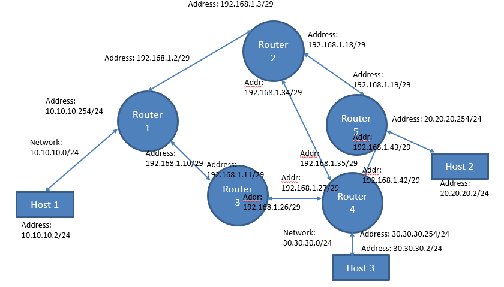

# Distance Vector Router Implementation

A full implementation of the **Distance Vector (RIP-like) routing protocol** in Python, designed to run inside Docker containers for simulating multi-router network topologies.

> **Course**: ECE441 - Network Protocol Design  
> **Authors**: Nikolaos Kalamaris, Vasileios Grapsopoulos  
> **University of Thessaly**

---

## Features

| Feature | Description |
|---------|-------------|
| **Distance Vector Algorithm** | Classic Bellman-Ford based routing |
| **Split Horizon with Poison Reverse** | Prevents count-to-infinity problem |
| **Triggered Updates** | Immediate propagation of topology changes |
| **TCP Neighbor Discovery** | Reliable handshake and keepalive mechanism |
| **UDP Route Exchange** | Efficient periodic and triggered updates |
| **Kernel Route Installation** | Routes are installed system-wide via `ip route` |
| **Automatic Cleanup** | Dead neighbors and expired routes are garbage collected |
| **Protocol Buffers** | Efficient binary message serialization |

---

## Architecture

```
┌─────────────────────────────────────────────────────────────┐
│                        router.py                            │
├──────────────────────┬──────────────────────────────────────┤
│   TCP Server         │   UDP Server                         │
│   (Neighbor Setup)   │   (Route Updates)                    │
├──────────────────────┼──────────────────────────────────────┤
│   Hello Sender       │   Periodic DV Sender                 │
│   (Keepalives)       │   (Every 20s)                        │
├──────────────────────┴──────────────────────────────────────┤
│                  Routing Table Manager                      │
│         (with Linux Kernel integration via ip route)        │
└─────────────────────────────────────────────────────────────┘
```

### Message Types (Protocol Buffers)

| Message | Purpose |
|---------|---------|
| `ConnParamMessage` | TCP handshake - exchange router names and UDP ports |
| `HelloMessage` | TCP keepalive - detect dead neighbors |
| `DVMessage` | UDP routing update - contains list of routes with metrics |

---

## Project Structure

```
.
├── router.py              # Main router implementation
├── messages/
│   ├── dv.proto           # Protocol Buffers message definitions
│   └── dv_pb2.py          # Generated Python classes
├── Dockerfile_router      # Docker image for routers
├── Dockerfile_host        # Docker image for hosts
├── build-docker-containers.sh
├── deploy_containers.sh   # Deploy the test topology
└── cleanup.sh             # Stop and remove containers
```

---

## Reference Topology

The following topology is used for testing and demonstration:



### Topology Details

| Router | Connected Networks | Neighbors |
|--------|-------------------|-----------|
| Router 1 | 10.10.10.0/24 (Host 1) | Router 2, Router 3 |
| Router 2 | - | Router 1, Router 3, Router 5 |
| Router 3 | - | Router 1, Router 2, Router 4 |
| Router 4 | 30.30.30.0/24 (Host 3) | Router 3, Router 5 |
| Router 5 | 20.20.20.0/24 (Host 2) | Router 2, Router 4 |

### Running the Reference Topology

After deploying the containers, copy the files and run each router with the following commands:

```bash
# Copy files to all routers
for N in 1 2 3 4 5; do
  docker cp router.py router$N:/
  docker cp messages/dv_pb2.py router$N:/
done

# Run each router (in separate terminals)
docker exec -it router1 python3 router.py r1 5000 5001 192.168.1.3:5000 192.168.1.11:5000
docker exec -it router2 python3 router.py r2 5000 5001 192.168.1.2:5000 192.168.1.19:5000 192.168.1.35:5000
docker exec -it router3 python3 router.py r3 5000 5001 192.168.1.10:5000 192.168.1.27:5000
docker exec -it router4 python3 router.py r4 5000 5001 192.168.1.26:5000 192.168.1.34:5000 192.168.1.43:5000
docker exec -it router5 python3 router.py r5 5000 5001 192.168.1.18:5000 192.168.1.42:5000
```

---

## Quick Start

### Prerequisites

- Docker
- Python 3
- Protocol Buffers compiler (`protoc`)

```bash
# Install dependencies (Ubuntu/Debian)
sudo apt update && sudo apt install -y docker.io python3 python3-pip protobuf-compiler
sudo usermod -aG docker $USER
# Log out and back in for group changes to take effect
```

### Step 1: Generate Protocol Buffer Files

```bash
cd Project-2025-2026
protoc -I=messages/. --python_out=./messages/ messages/dv.proto
```

### Step 2: Build Docker Containers

```bash
./build-docker-containers.sh
```

### Step 3: Deploy the Topology

```bash
./deploy_containers.sh
```

### Step 4: Copy Files to Routers

Copy the router script and protobuf files to each router container:

```bash
# For each router (N = 1, 2, 3, ...)
docker cp router.py routerN:/
docker cp messages/dv_pb2.py routerN:/
```

### Step 5: Run the Router

On each router container, run:

```bash
docker exec -it routerN python3 /router.py <ROUTER_NAME> <TCP_PORT> <UDP_PORT> [NEIGHBOR_IP:TCP_PORT ...]
```

**Parameters:**
| Parameter | Description | Example |
|-----------|-------------|---------|
| `ROUTER_NAME` | Unique identifier for this router | `r1`, `r2`, etc. |
| `TCP_PORT` | Port for TCP connections (handshake/keepalive) | `5000` |
| `UDP_PORT` | Port for UDP routing updates | `5001` |
| `NEIGHBOR_IP:TCP_PORT` | IP and TCP port of each neighbor router | `192.168.1.3:5000` |

**Example for a 3-router chain topology:**

```bash
# Router 1 (connected to Router 2)
docker exec -it router1 python3 /router.py r1 5000 5001 10.0.12.2:5000

# Router 2 (connected to Router 1 and Router 3)
docker exec -it router2 python3 /router.py r2 5000 5001 10.0.12.1:5000 10.0.23.3:5000

# Router 3 (connected to Router 2)
docker exec -it router3 python3 /router.py r3 5000 5001 10.0.23.2:5000
```

### Step 6: Test Connectivity

From any host or router, ping a destination:

```bash
docker exec -it host1 ping <destination_ip>
```

### Cleanup

```bash
./cleanup.sh
```

---

## How It Works

### 1. Neighbor Discovery (TCP)
When a router starts, it connects to its configured neighbors via TCP. They exchange:
- Router names
- UDP ports for routing updates

A background thread sends periodic "Hello" messages (every 5s) to detect dead neighbors.

### 2. Route Exchange (UDP)
Every 20 seconds, each router broadcasts its entire routing table to all neighbors via UDP.

When a topology change occurs (new route, better path, or dead neighbor), a **triggered update** is sent immediately.

### 3. Distance Vector Algorithm
- New routes are added with metric = neighbor's metric + 1
- Better paths (lower metric) replace existing routes
- Split Horizon with Poison Reverse: routes learned from a neighbor are advertised back with metric = 16 (infinity)

### 4. Kernel Integration 
**This is what makes the router work in the real world, not just virtually.**

When routes are learned or updated, they are installed into the Linux kernel's routing table:
```python
ip route replace <prefix> via <next_hop_ip>
```

When routes expire or become unreachable:
```python
ip route del <prefix>
```

### 5. Garbage Collection
- Neighbors silent for >15 seconds are considered dead
- Routes not refreshed for >60 seconds are removed
- Dead neighbor routes are "poisoned" (metric = 16) before removal

---

## Sample Output

```
[14:32:01] [Init] Router Started: Name='r1'
[14:32:01] [Routes] Added local network: 10.0.1.0/24
[14:32:01] [TCP] Listening on 0.0.0.0:5000
[14:32:01] [UDP] Listening on 0.0.0.0:5001
[14:32:03] [Connected] r2 (IP: 192.168.1.3)
[14:32:03] [TRIGGERED] Sent update to r2 (2 routes)
[14:32:05] [UDP-Recv] Update from r2 (Seq: 1)
[14:32:05] [New Route] 10.0.2.0/24 via r2 (Cost 1)
[14:32:05] [Kernel] Installed: 10.0.2.0/24 via 192.168.1.3
```

---

## Protocol Specification

### Constants
| Name | Value | Description |
|------|-------|-------------|
| `INFINITY` | 16 | Maximum metric (unreachable) |
| Hello Interval | 5s | TCP keepalive frequency |
| Update Interval | 20s | Periodic routing update frequency |
| Neighbor Timeout | 15s | Time before neighbor is considered dead |
| Route Timeout | 60s | Time before route expires |

### Message Format (Protocol Buffers)

See `messages/dv.proto` for the full specification.

---

## Troubleshooting

| Issue | Solution |
|-------|----------|
| Routes not being installed | Ensure the container has `NET_ADMIN` capability |
| Neighbors not connecting | Check that TCP ports are correct and reachable |
| Routes expiring too fast | Verify periodic updates are being sent (check logs) |
| "Permission denied" on ip route | Run with root privileges inside container |

---

## License

This project was developed as part of the ECE441 course at the University of Thessaly.
